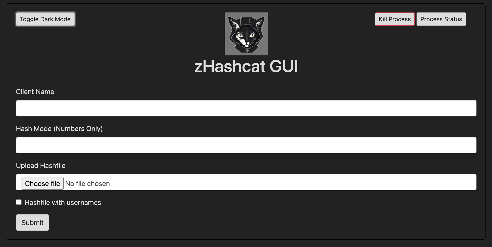

# zHashcat-GUI

*This program is to be executed on the password cracking machine.*

This is a simple Python web application built with Flask. The application provides a web interface for Hashcat where users can upload a hash file and set some parameters. The application then runs a specified powershell commands/scripts with the user inputs as arguments.

## Features

- File upload: Users can upload a file through the web interface.
- User inputs: Users can enter their client name and hash mode.
- Process status check: Users can check the status of the running process.
- Dark mode: Users can toggle dark mode.
- Kill process: Users can kill the running process.
- Usernames presence: Users can indicate whether usernames are present in the uploaded hash file.

## Screenshots
### Light Mode

### Dark Mode

## Usage

1. Clone the repository.
2. Install the requirements: `pip install -r requirements.txt`
3. Run the application: `python zHashcat-GUI.py`
4. Open a web browser and navigate to `localhost:5000`.

## Requirements

- Python 3
- Flask

## Contributing

Pull requests are welcome. For major changes, please open an issue first to discuss what you would like to change.

## Versioning

- Current Version - 1.0
- Created: 25 Oct 2023
- Updated: N/A 
- v1.0 - Creation of app

## Authors

**Zak Clifford** - [ZSECURE](https://github.com/ZSECURE)

## License

This project is licensed under the MIT License - see the [LICENSE](LICENSE) file for details

## About Me

- Personal Twitter: [@zakclifford](https://twitter.com/zak_hax)
- Website: [zsecure.uk](https://zsecure.uk/)
